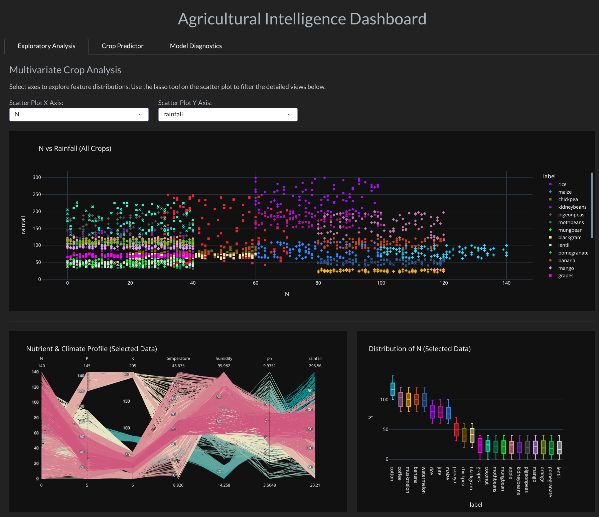
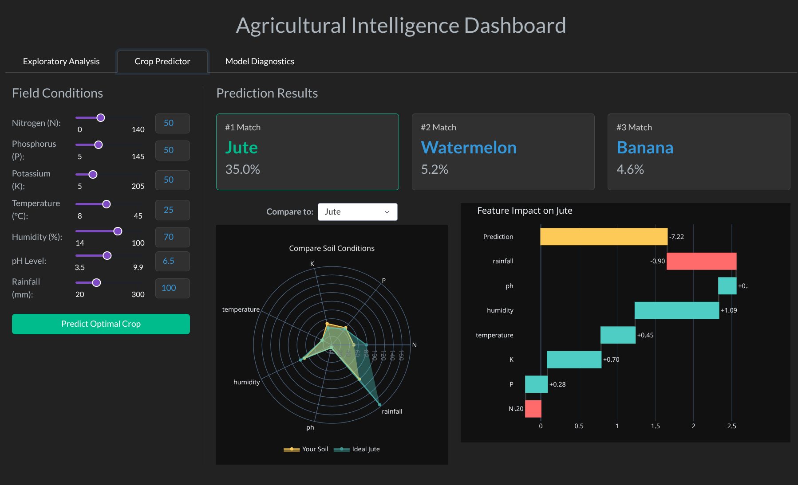
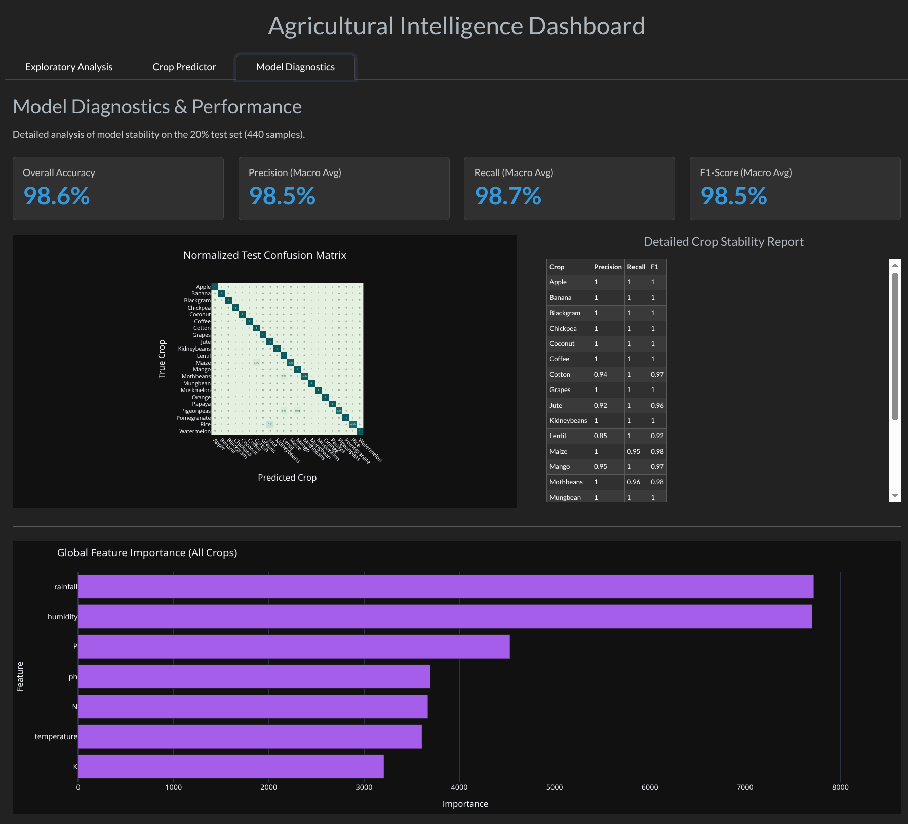

# Agricultural Intelligence Dashboard


An End-to-End Machine Learning Application designed to recommend optimal crop choices based on real-time soil nutrient and climate parameters. This application serves both high-level agronomists and localized farming use cases by transforming complex multivariate data and predictive modeling into an interactive, explainable visual experience.

Built using the [Kaggle Crop Recommendation Dataset](https://www.kaggle.com/datasets/aksahaha/crop-recommendation).

---

## 📌 Features & Architecturegit add README.md

* **High-Performance ML Inference**: Trained and optimized a LightGBM multiclass classifier across 22 distinct crop types.
* **Explainable AI (XAI)**: Integrated SHAP (Shapley Additive exPlanations) to provide local feature importance, transforming the "black box" prediction into a transparent, explainable decision-support tool.
* **Dynamic UI & State Management**: Deployed the inference engine within a modern Python Dash UI, managing complex state callbacks, cross-filtering, JSON serialization across multi-trace visualizations, and optimized asset loading.

## 📊 Dashboard Overview

The application is structured into three main analytical tabs:

### 1. Exploratory Analysis
Engineered a cross-filtered Exploratory Data Analysis (EDA) interface using custom Plotly callbacks. Users can dynamically select specific axes to explore feature distributions. Using the lasso tool on the scatter plot interactively filters the detailed views below, rendering complex multivariate feature distributions in real time through Parallel Coordinates and Box plots.



### 2. Crop Predictor
An interactive, localized inference engine. Users can input 7 distinct soil conditions (Nitrogen, Phosphorous, Potassium, Temperature, Humidity, pH Level, Rainfall) via dynamic sliders. 
* **Prediction Results:** Displays the top 3 optimal crop matches with confidence percentages.
* **Geometric Profile-Matching:** Utilizes dynamic radar charts to visually compare the user's live soil inputs against the pre-computed historical "ideal" centroids for the predicted crop.
* **Feature Impact (SHAP):** Generates local, on-the-fly waterfall charts detailing exactly how each user input negatively or positively influenced the model's final top prediction.



### 3. Model Diagnostics
A diagnostic reporting module that details the model's performance stability over a 20% validation split (440 samples). It dynamically renders test-set stability metrics including an impressive ~98.6% overall accuracy. Visualizations include a massive normalized confusion matrix across the 22 crops, a detailed precision/recall table, and global feature importance charts validating the model's rigor.



---

## 🚀 Getting Started

### Prerequisites
Make sure you have Python 3.8+ installed.

### 1. Install Dependencies
Clone the repository and install the required Python packages:
```bash
pip install -r requirements.txt
```

### 2. Train the Model and Generate Artifacts
Ensure the `Crop_recommendation.csv` file from Kaggle is located inside the `data/` folder, then run the ML pipeline to train the LightGBM classifier and generate required artifacts (SHAP values, centroids, models):
```bash
python train_model.py
```

### 3. Launch the Dashboard
Start the local Dash server to interact with the application:
```bash
python app.py
```
Navigate (or Ctrl+Click) on the IP address generated.

## Project Structure
```
crop-recommendation-dashboard/
├── app.py                      # Main Dash application and routing
├── train_model.py              # ML pipeline, LightGBM training, and artifact generation
├── requirements.txt            # Project dependencies
├── README.md                   # Project documentation
├── data/
│   └── Crop_recommendation.csv # Raw Kaggle dataset
├── tabs/                       # Modular UI components
│   ├── __init__.py
│   ├── tab1_eda.py             # Layout for Exploratory Analysis
│   ├── tab2_ml.py              # Layout for Predictor & SHAP Visualizations
│   └── tab3_diagnostics.py     # Layout for Model Evaluation Metrics
├── models/                     # Saved joblib/pickle ML artifacts and pre-computed CSVs
└── images/                     # Screenshots for documentation
```